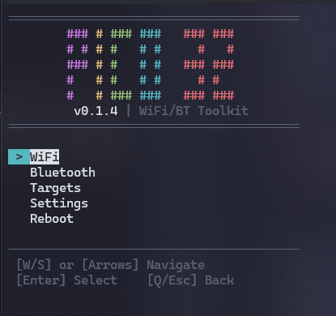

# ESP32 Marauder TUI

Stripped-down, menu-based TUI for ESP32 Marauder. WiFi/Bluetooth attack platform controlled via serial terminal using WSAD.



## Hardware Target

- **ESP32 Dev Module** (240MHz, 320KB RAM, 4MB Flash)
- No PSRAM, no display, no SD card, no battery, no NeoPixel

## Features

### WiFi

- **Scan**: AP scan, Station scan
- **Sniff**: Beacon, Probe Request, Deauth, PMKID/EAPOL, Pwnagotchi, Raw packets
- **Attack**: Deauth, Beacon Spam (random/list), Rick Roll, Funny SSIDs

### Bluetooth

- **Scan**: All devices, AirTags, Flipper Zero, Card Skimmers
- **Spam**: Apple (Sour Apple), Windows (SwiftPair), Samsung, Google FastPair, All

## Navigation

```text
W/S        - Move selection
Enter      - Select / Enter submenu
ESC or Q   - Go back / Exit submenu
Any key    - Stop running scan/attack
```

## Building

Requires [PlatformIO](https://platformio.org/).

```bash
cd marauder_tui
pio run
```

Flash to device:

```bash
pio run -t upload
```

## Serial Connection

Connect at **115200 baud**. Use a terminal with ANSI support:

- **Windows**: Windows Terminal, PuTTY
- **Linux/Mac**: Kitty, iTerm2, native terminal

## Menu Structure

```text
ESP32 Marauder TUI v1.0
├── WiFi
│   ├── Scan APs
│   ├── Scan Stations
│   ├── Sniff >
│   │   ├── Beacon Frames
│   │   ├── Probe Requests
│   │   ├── Deauth Packets
│   │   ├── PMKID/EAPOL
│   │   ├── Pwnagotchi
│   │   └── Raw Packets
│   ├── Attack >
│   │   ├── Deauth Selected
│   │   ├── Beacon Random
│   │   ├── Beacon List
│   │   ├── Rick Roll
│   │   └── Funny SSIDs
│   └── Set Channel
├── Bluetooth
│   ├── Scan All
│   ├── Scan Airtags
│   ├── Scan Flippers
│   ├── Card Skimmers
│   └── Spam >
│       ├── Apple (Sour)
│       ├── Windows
│       ├── Samsung
│       ├── Google
│       └── All Spam
├── Targets
│   ├── List APs
│   ├── List Stations
│   ├── List SSIDs
│   ├── Select/Deselect
│   ├── Add SSID
│   └── Clear All
├── Settings
│   └── Channel
└── Reboot
```

## Firmware Size

~1MB (fits comfortably in 4MB flash with OTA partition)

## Credits

Inspired by and based on [ESP32 Marauder](https://github.com/justcallmekoko/ESP32Marauder) by JustCallMeKoko.
